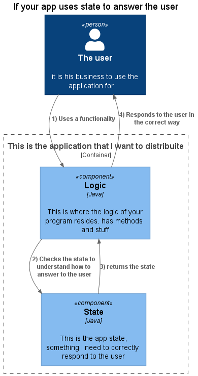
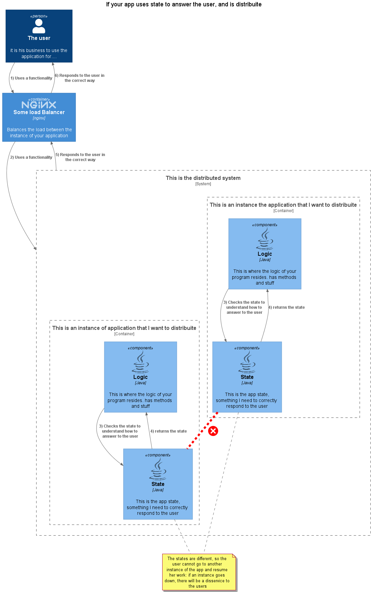
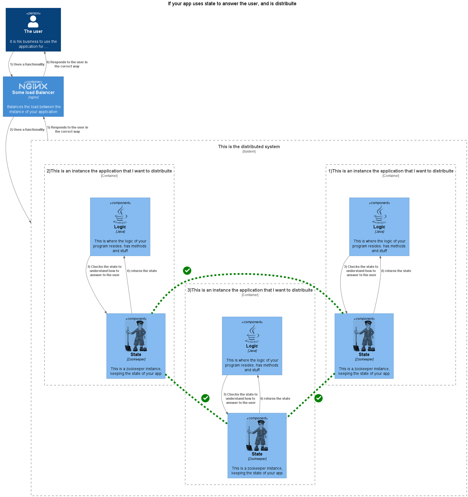
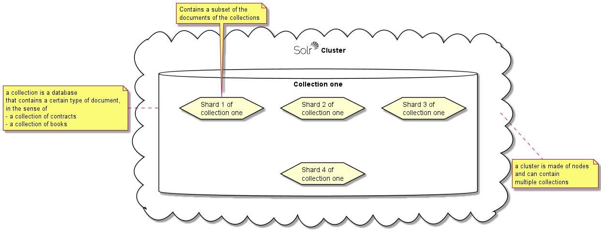
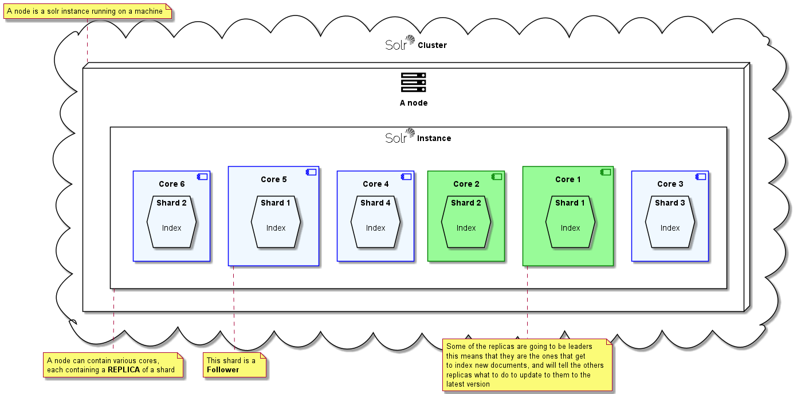
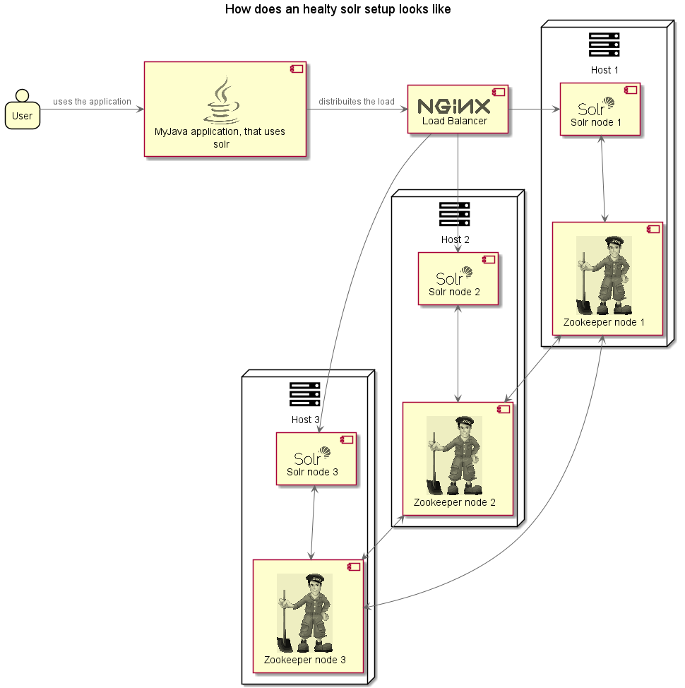

# Zookeeper and Solr

Follows a curated guide to understanding and deploying Solr and Zookeeper, in spring java springboot souce.

## What is Zookeeper

```Provides distributed coordination and synchronization of settings, state of some application state```

But what does it mean? Many of us had this problem: 

```I have a nice application, now I need to have it distribuited, so I can scale.``` 



And the following question is: 

```How do I distribuite the state of my application to guarantee hig availability and the state always updated?```

We all know that the issue here is about maitaining that distribuited state, and we all know that is a steaming mess of issues and retries, and connections and corner cases



Zookeeper answers to that problem:  it keeps the STATE of a distributed application. It also offers _high availability_ to your distributed application, in the same library: if one

- Keeps the state of the app on ZK
- Sets ZK in a way that "MAKES SENSE" (more on this later)

then has solved the problem of distribuiting a state for an app.


### Fun facts

A cluster of Zookeepers is called an ```ensemble```. An ensamble MUST be composed of an odd number of total nodes, so to guarantee, that, at least in principle, half minus one nodes can go down, and the ensamble has still a majority. A minorty ensamble is a useless ensamble, because one cannot say that the data contained in it is good or not.

## What is Solr Cloud

Solr Cloud provides text search capabilities to an application. Has distributed indexing, centralized configuration and automated failover. It is like a database that can search trough text very effectively. Like databases, it has indexes. It provides failover capabilities trough replicas.

### Solr components

Solr is a database, that contains documents. Documents of a certain type, which are going to be searched in the same way, are called a ```collection```.
A collection can be split in ```shards```, and each shard contains a partition of the full set of documents in the collection. A shard is usually
a partition on the range of the index: sort of the equivalent of the shelves
in a library containing the authors from SBA to Z



A shard can be replicated on multiple nodes, and the nodes will decide
who is the leader of the pack of shards, the ```leader shard```



Such shard will be in charge of making the changes to the partition of the index, and distribuite the changes to the others. A core is an instance of a shard.

Here is the deal:

```Solr Cloud uses Zookeeper to maintain and distribuite the state of the cores and the configuration of the collection```

And that means, if Zookeeper has no quorum, very bad things happen

- The cores cannot know who is the leader of the pack, so no new indexes can be added, all the documents sent to any node for indexing remain in the t-logs, and no document can be deleted: basically the index freezes!

- No new nodes can go up, because they can't access the configuration and do not know where are the other nodes are and cannot import the indexes: solr phisically doesn't know where are the indexes: this is extremely bad news for any sysadmin.

No ZK(quorum), No party.

## Notes
- Indexes are sharded, shards have replicas, and a maximum number of allowed replicas per node.
- if there is no ZK quorum, there is no available collection in the connected nodes (even if the other nodes are online): basically solr thinks he is in minority, even if the shards are actually online.

## A healty configuration for SOLR

let this sink in



 nothing less is a good idea if you want high availability.


# Links and sources
- https://solr.apache.org/guide/8_8/solr-tutorial.html
- https://github.com/docker-solr/docker-solr
- https://javadeveloperzone.com/solr/solr-tutorial/
- http://www.solrtutorial.com/solrj-tutorial.html
- https://riptutorial.com/solrj
- https://www.youtube.com/watch?v=Zw4M4NGv-Rw
- https://stackoverflow.com/questions/59943241/zookeeper-admin-server-port
- https://lucidworks.com/post/understanding-transaction-logs-softcommit-and-commit-in-sorlcloud/
- https://solr.apache.org/guide/8_8/setting-up-an-external-zookeeper-ensemble.html
- https://zookeeper.apache.org/doc/r3.4.10/zookeeperAdmin.html
- https://solr.apache.org/guide/6_6/updatehandlers-in-solrconfig.html
- https://stackoverflow.com/questions/6954358/how-to-optimize-solr-index
- https://cwiki.apache.org/confluence/display/solr/FAQ#How_can_I_delete_all_documents_from_my_index.3F
- https://lastfiascorun.com/cities/often-asked-how-do-you-purge-messages-in-rabbitmq.html
- https://facingissuesonit.com/2020/03/29/spring-boot-data-configuration-properties-and-default-value/
- https://docs.spring.io/spring-boot/docs/1.4.x/reference/html/common-application-properties.html